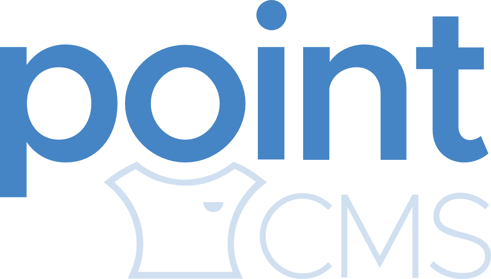

<br />
<p align="center"></p>
<br />
Point is a lightweight, minimal and super-fast content management system for portfolio websites.

## Getting Started

These instructions will get you a copy of the project up and running on your local machine or live server. There are 2 important things you need to know. This project is split up in two, different branches - master and staging. 

The master branch is a stripped down, production-ready version of the project, with minified files and optimized file structure. This means that this branch should be used only when deploying.

If you want get a copy of the project on your local machine for testing and development purposes, you will need to download/pull the staging branch. It contains non-minified Javascript and CSS files. 

If you want to deploy Point CMS without playing around, download the master branch, which is production ready.

### Prerequisites

This section covers what things you need to install the software and how to install them. Here's the list:

List of technologies:
```
Linux (version and distribution doesn't matter, but Ubuntu is preferred)
Apache
Python 2.7
Pip
MariaDB/MySQL
MySQLdb
WSGI (Web Server Gateway Interface)

```
List of Python Pip packages:
```
virtualenv
Flask
passlib
flask-mysqldb
```

### Installing

#### Overview:

Here's a brief overview of the things you'll need to install in order to use Point:

```
* Install Apache, MySQL/MariaDB, Python dependencies and Flask (resource provided)
* Install pip dependencies (list provided above)
* Create a database
* Register a user for the Dashboard (using register.py script)
* Configure mbconf.py with database credentials
* Run the app
```

#### Instructions
For instructions on how to install and setup Flask, please check the following resource: https://www.digitalocean.com/community/tutorials/how-to-deploy-a-flask-application-on-an-ubuntu-vps

As for installing pip packages, you can simply type: pip install [package-name].

Once you have Flask installed and all the required pip packages, you can go ahead and create a MySQL database. Then, import the point-cms.sql file into the freshly created database to setup the database tables.

Once the tables are loaded, you'll need to create a user for Point using the register.py script that's in the root directory. And finally, you'll need ton configure the mbconf.py file with the database credentials so PointCMS can establish a connection and be able to write/read data from the database. At last, compile the main (init.py) file to start the server.

To compile and start Point, run the following command while in the root directory:
```
python **__init__.py**
```

Notice: The setup for the database should work in MySQL and the open-source fork MariaDB.

## Built With

* Python 2.7 (https://www.python.org/)
* Flask(http://flask.pocoo.org/)
* MariaDB (https://mariadb.org/)

## Contributing

If you like to contribute in any way, please do so. At this point, there aren't specific rules. Just download/clone this git repository, switch to the staging branch and do stuff. If you make an improvement or do implement a new feature, please submit a pull request and we'll review it.

List of features that we could use a help to implement:
* X

## Authors

* **Stefan Ivanovski** - *Front-end and Dashboard* - [imstef](https://github.com/imstef)
* **Milos Kostadinovski** - *Database and Backend/API* - [imilosk](https://github.com/imilosk)

See also the list of [contributors](https://github.com/your/project/contributors) who participated in this project.

## License

This project is licensed under the GPLv2 License - see the [LICENSE.md](LICENSE.md) file for details.
