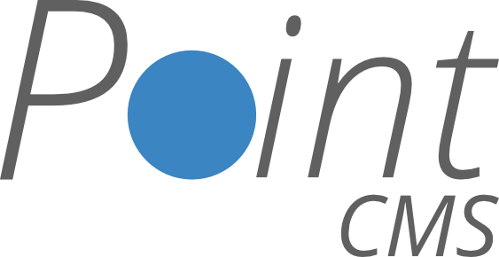

<p align="center"></p>

Point is a lightweight, minimal and super-fast content management system for portfolio websites.

## Getting Started

These instructions will get you a copy of the project up and running on your local machine or live server. There are 2 important things you need to know. This project is split up in two, different branches - master and staging. 

The master branch is very similar to the staging one, except it is stripped down version of the project, with minifed files and optimized file structure. This means that this branch should be used only when deploying.

If you want get a copy of the project on your local machine for testing and development purposes, you will need to download/pull the staging branch. It contains non-minified Javascript and CSS files, as well as the SCSS. If you want to deploy Point CMS without playing around, download the master brach, which is production ready.

### Prerequisites

This section covers what things you need to install the software and how to install them. Here's the list:

List of technologies:
```
Linux (version and distro doesn't matter, but Ubuntu is preferred)
Apache
Python 2.7 or later
Pip
MariaDB/MySQL
WSGI (Web Server Gateway Interface)

```
List of Python Pip packages:
```
virtualenv
Flask
passlib
MySQLdb
```

For instructions on how to install all this stuff, you can reffer to 

### Installing

A step by step series of examples that tell you have to get a development env running

Say what the step will be

```
Give the example
```

And repeat

```
until finished
```

End with an example of getting some data out of the system or using it for a little demo

## Built With

* [Dropwizard](http://www.dropwizard.io/1.0.2/docs/) - The web framework used
* [Maven](https://maven.apache.org/) - Dependency Management
* [ROME](https://rometools.github.io/rome/) - Used to generate RSS Feeds

## Contributing

Please read [CONTRIBUTING.md](https://gist.github.com/PurpleBooth/b24679402957c63ec426) for details on our code of conduct, and the process for submitting pull requests to us.

## Authors

* **Billie Thompson** - *Initial work* - [PurpleBooth](https://github.com/PurpleBooth)

See also the list of [contributors](https://github.com/your/project/contributors) who participated in this project.

## License

This project is licensed under the MIT License - see the [LICENSE.md](LICENSE.md) file for details.
